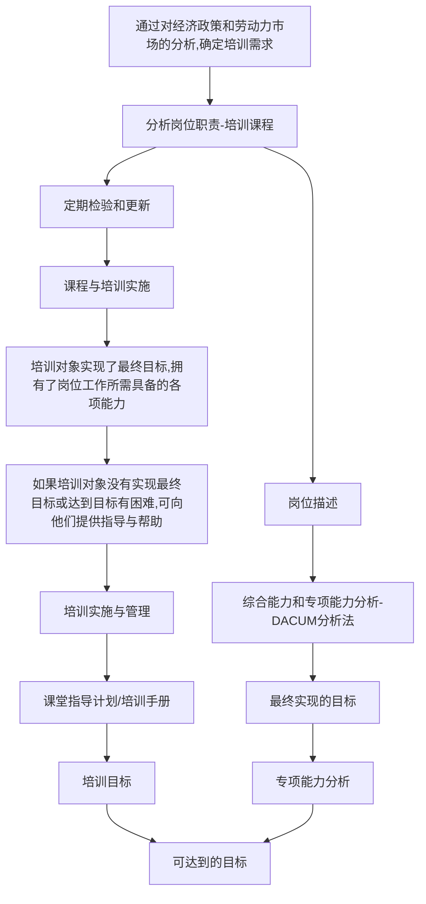

## ADDIE 模型
ADDIE 模型是从 analysis 分析、design 设计、development 开发、implementation 实施 到 evaluation 评估 的整个过程。

包括三方面内容：
- 要学什么（学习目标的制定）
- 如何去学（学习策略的应用）
- 如何评价学习者的学习效果（学习考评实施）
### Analysis 分析
外部分析：
- 学习者分析
- 培训环境分析
- 媒体分析
内部分析：
- 培训目标和任务分析
- 培训内容分析
### Design 设计
宏观设计：
- 设计课程大纲
- 培训策略
- 课程体系规划
微观设计：
- 设计培训内容、脚本
- 培训知识和技能分类、处理
### Development 开发
内容包括课程表现形式、教学活动设计、接口设计、页面设计、测试方法设计等。
### Implementation 实施
具体开展教学培训活动，并对教学和培训过程进行记录
### Evaluation 评估
确定教学或培训活动是否有效，内容包括课程内容评估、接口评估、学习效果评估等。
## CBET 模型
Competency based education and training model, 能力本位教育培训模型，它是以某一工作岗位所需的能力作为开发课程的标准，以培训对象获得这种能力为培训的宗旨。

### 步骤
1. 通过分析经济政策和劳动力市场确定培训需求
2. 根据岗位描述分析岗位职责
3. 进行综合能力和专项能力分析（DACUM 方法）
4. 明确教学目标、教学标准
5. 制定培训计划，准备培训材料
6. 实施教学和评估，对达成目标有困难的，向其提供资料、方法等辅助帮助
### 注意要点
- 正确理解职业能力，包括知识、技能、经验、态度等的综合能力
- 要确定上述能力与职业相关
- 要把这些能力的标准全都转化为课程目标
- 在培训之前，向培训对象说明应具备的能力以及考核标准
## DACUM 模型
Develop A curriculum, 课程开发，是一种以委员会形式进行职业任务分析，从而获得某项任务所具备的各项技能的过程和方法。

强调从社会需要出发，通过和同人单位合作，以能力培训为中心来进行培训设计、培训实施与培训评价。
### 步骤
- 成立 DACUM 小组
- DACUM 初阶分析
	- 职业名称
	- 职业定义
	- 职务
	- 工作任务
- 确认分析：DACUM 小组对工作与任务分析进行确认
- 培训分析：分析完成任务应获得的技能和知识
- 课程开发与培训实施
### DACUM 模型的局限性
适用于在工作活动中，工作任务有一定的固定性程序和重复性特征的再生性技能。